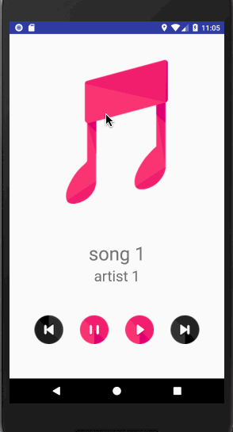

# Musical Structure App (part 1)
> A multi-screen app that store a list of music and able to enter to now playing page.

## Getting Started

* You can *[clone](https://github.com/arrickx/MusicalStructureApp.git)* or *[download](https://github.com/arrickx/MusicalStructureApp.git)* this project via [GitHub](https://github.com) to your local machine.
* Download and Install *[Android Studio](https://developer.android.com/studio/index.html)*

### How to use

* Open existing Android Studio Project
* Use Android Studio emulators to run this app
* (Or use your Android phone to run this app via Android Studio)

## License

* This project is licensed under the MIT License - see the [LICENSE](LICENSE) file for details.

## Acknowledgments

* **Icon Pack** was provided by [Roundicons](https://www.flaticon.com/packs/multimedia-2).
* **ItemClickSupport** was provided by [Hugo Visser](http://www.littlerobots.nl/blog/Handle-Android-RecyclerView-Clicks/).

